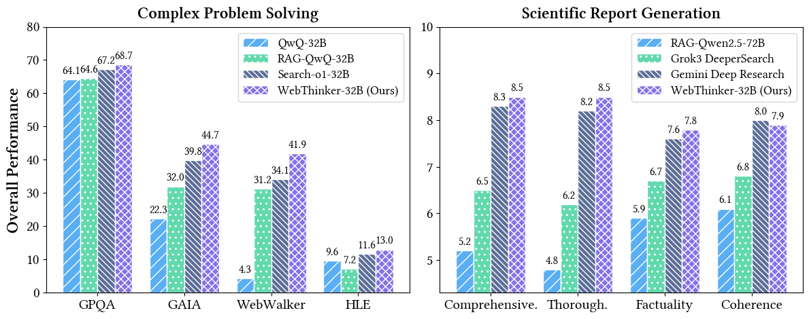
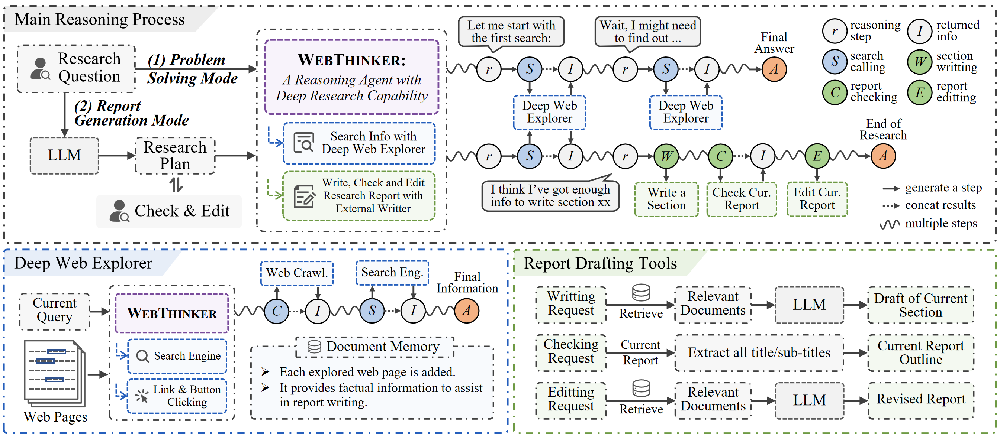

<h1 align="center"> 🌐 WebThinker: Empowering Large Reasoning Models with Deep Research Capability</a></h1>


<div align="center"> 

[](https://foremost-beechnut-8ed.notion.site/WebThinker-Empowering-Large-Reasoning-Models-with-Deep-Research-Capability-d13158a27d924a4b9df7f9ab94066b64) 
[](https://arxiv.org/abs/2504.21776)
[](https://huggingface.co/papers/2504.21776)
[](https://opensource.org/licenses/MIT) 
[](https://www.python.org/downloads/release/python-390/) 
[](https://x.com/kakakbibibi/status/1917768235069628823)
</div>

<p align="center">
🤗 <a href="https://huggingface.co/lixiaoxi45/WebThinker-QwQ-32B" target="_blank">WebThinker-QwQ-32B</a> ｜
🤗 <a href="https://huggingface.co/lixiaoxi45/WebThinker-R1-7B" target="_blank">WebThinker-R1-7B</a> ｜
🤗 <a href="https://huggingface.co/lixiaoxi45/WebThinker-R1-14B" target="_blank">WebThinker-R1-14B</a> ｜
🤗 <a href="https://huggingface.co/lixiaoxi45/WebThinker-R1-32B" target="_blank">WebThinker-R1-32B</a>
</p>


<h5 align="center"> If you like our project, please give us a star ⭐ on GitHub for the latest update.</h5>

## 📣 Latest News

- **[May 9, 2025]**: The brief introduction of WebThinker can be found on platforms like **[X](https://x.com/kakakbibibi/status/1917768235069628823)**, **[Zhihu](https://zhuanlan.zhihu.com/p/1903981050780192911)**, and **[WeChat](https://mp.weixin.qq.com/s/lVrTZQLmrJkkG5QYcEZTFA)**.
- **[May 1, 2025]**: 🤗 **[WebThinker Model Collection](https://huggingface.co/collections/lixiaoxi45/webthinker-6812d5fd1287ee53d68f0557)** is now available on Hugging Face. You can deploy our optimized models for your deep research tasks.
- **[May 1, 2025]**: 📄 Our paper is now available on **[arXiv](https://arxiv.org/abs/2504.21776)** and **[Hugging Face](https://huggingface.co/papers/2504.21776)**.
- **[March 31, 2025]**: 🎉 **[WebThinker Notion Page](https://foremost-beechnut-8ed.notion.site/WebThinker-Empowering-Large-Reasoning-Models-with-Deep-Research-Capability-d13158a27d924a4b9df7f9ab94066b64)** launched with comprehensive project details.
- **[March 31, 2025]**: 🚀 Full codebase released. WebThinker now supports deep research with open-source reasoning models like QwQ-32B.

## 🎬 Demo

<div align="center">
    <video src="https://github.com/user-attachments/assets/a38e82ec-5aed-4efe-a8b8-e9ee2d97e9b9" />
</div>

## 💡 Overview

**WebThinker** is a deep research framework fully powered by large reasoning models (LRMs). WebThinker enables LRMs to **autonomously search**, **deeply explore web pages**, and **draft research reports**, all within their thinking process.

Unlike existing open-source deep search agents that typically employ retrieval-augmented generation (RAG) with predefined workflows, WebThinker allows the reasoning model itself to perform actions during thinking, achieving **end-to-end task execution** in a single generation.

### 📊 Overall Performance

<p align="center">
  
</p>

As shown above, WebThinker consistently outperforms competing approaches on both knowledge-intensive complex reasoning benchmarks (GPQA, GAIA, WebWalkerQA, HLE) and open-ended reasoning tasks for report generation. Our WebThinker-32B with QwQ-32B as backbone reasoning model achieves superior performance across all tasks.

### ✨ The WebThinker Framework



**WebThinker** enables reasoning models to autonomously conduct web searches and web page navigations to acquire external knowledge during their reasoning process. This approach significantly reduces the time and costs associated with information gathering for researchers in knowledge-intensive fields. Furthermore, WebThinker allows LRMs to draft section content while thinking and searching, producing comprehensive, customized reports that directly address users' research questions.

**Key Features:**
- We introduce a **Deep Web Explorer** that empowers LRMs to search, navigate pages by clicking interactive elements (like links or buttons), and extract relevant information. Based on initial search results, the LRM can initiate follow-up searches and traverse deeper links until it collects all relevant information.
- For scientific reporting, our **Autonomous Think-Search-and-Draft** strategy integrates real-time knowledge seeking with report creation. We equip LRMs with three specialized tools: (1) drafting content for specific chapters, (2) checking the current report, and (3) editing the report—ensuring reports remain comprehensive, coherent, and adaptive to new insights.
- We're developing **RL-based training strategies** to optimize end-to-end task performance by leveraging large-scale reasoning trajectories from complex tasks. Using accuracy of reasoning, tool usage, and final outputs, we construct preference pairs for online DPO training, enabling the model to progressively improve its research capabilities.


## 🔧 Installation

###  Environment Setup
```bash
# Create conda environment
conda create -n webthinker python=3.9
conda activate webthinker

# Install requirements
cd WebThinker-main
pip install -r requirements.txt
```

## 🏃 Quick Start

### Pre-preparation

#### Model Serving
Before running WebThinker, ensure your reasoning model and auxiliary model are served using vLLM. In our experiments, we use QwQ-32B as the reasoning model and Qwen-32B-Instruct as the auxiliary model. You can also explore other instruction-tuned models as your auxiliary model, which will be used in webpage reading, report writting/editting, evaluation, etc. For detailed instructions on model serving, see [here](https://docs.vllm.ai/en/stable/serving/distributed_serving.html). 

#### Web Parser Client
For better web crawling performance, we recommend setting up a web parser client in `scripts/search/bing_search.py` using [Crawl4AI](https://github.com/unclecode/crawl4ai). This will help handle JavaScript-rendered content and provide more reliable webpage extraction.

Now you can run different inference modes using the provided scripts. Below are examples of how to execute each mode:

### Problem Solving Mode

1. If you would like to ask a single question, run the following command:
```bash
python scripts/run_web_thinker.py \
    --single_question "What is OpenAI Deep Research?" \
    --bing_subscription_key "YOUR_BING_SUBSCRIPTION_KEY" \
    --api_base_url "YOUR_API_BASE_URL" \
    --model_name "QwQ-32B" \
    --aux_api_base_url "YOUR_AUX_API_BASE_URL" \
    --aux_model_name "Qwen2.5-32B-Instruct" \
    --tokenizer_path "PATH_TO_YOUR_TOKENIZER" \
    --aux_tokenizer_path "PATH_TO_YOUR_AUX_TOKENIZER"
```

2. If you would like to run results on benchmarks, run the following command:
```bash
python scripts/run_web_thinker.py \
    --dataset_name gaia \
    --split dev \
    --concurrent_limit 32 \
    --max_search_limit 15 \
    --bing_subscription_key "YOUR_BING_SUBSCRIPTION_KEY" \
    --api_base_url "YOUR_API_BASE_URL" \
    --model_name "QwQ-32B" \
    --aux_api_base_url "YOUR_AUX_API_BASE_URL" \
    --aux_model_name "Qwen2.5-32B-Instruct" \
    --tokenizer_path "PATH_TO_YOUR_TOKENIZER" \
    --aux_tokenizer_path "PATH_TO_YOUR_AUX_TOKENIZER"
```

### Report Generation Mode

1. If you would like to ask a single question, run the following command:
```bash
python scripts/run_web_thinker_report.py \
    --single_question "What are the models of OpenAI and what are the differences?" \
    --bing_subscription_key "YOUR_BING_SUBSCRIPTION_KEY" \
    --api_base_url "YOUR_API_BASE_URL" \
    --model_name "QwQ-32B" \
    --aux_api_base_url "YOUR_AUX_API_BASE_URL" \
    --aux_model_name "Qwen2.5-32B-Instruct" \
    --tokenizer_path "PATH_TO_YOUR_TOKENIZER" \
    --aux_tokenizer_path "PATH_TO_YOUR_AUX_TOKENIZER"
```

2. If you would like to run results on benchmarks, run the following command:
```bash
python scripts/run_web_thinker_report.py \
    --dataset_name glaive \
    --split test \
    --concurrent_limit 32 \
    --bing_subscription_key "YOUR_BING_SUBSCRIPTION_KEY" \
    --api_base_url "YOUR_API_BASE_URL" \
    --model_name "QwQ-32B" \
    --aux_api_base_url "YOUR_AUX_API_BASE_URL" \
    --aux_model_name "Qwen2.5-32B-Instruct" \
    --tokenizer_path "PATH_TO_YOUR_TOKENIZER" \
    --aux_tokenizer_path "PATH_TO_YOUR_AUX_TOKENIZER"
```

**Parameters Explanation:**
- `--dataset_name`: Name of the dataset to use (glaive).
- `--split`: Data split to run (test).
- `--single_question`: The question you want to ask when running in single question mode.
- `--concurrent_limit`: Maximum number of concurrent requests.
- `--max_search_limit`: Maximum number of search queries per reasoning session.
- `--bing_subscription_key`: Your Bing Search API subscription key.
- `--api_base_url`: Base URL for the main model API.
- `--model_name`: Name of the main model to use.
- `--aux_api_base_url`: Base URL for the auxiliary model API.
- `--aux_model_name`: Name of the auxiliary model to use.

### Run Demo

You can run the demo we have created with the following command, and we will conduct in-depth exploration and thinking based on the questions you input.
```bash
cd demo
streamlit run_demo.py
```

**Note:** Before running, it is necessary to configure the relevant parameters in `demo/settings.py`.

### Benchmarks

The benchmarks we utilize are categorized into two types:
- **Complex Reasoning Benchmarks:** 
    - **PhD-level Science QA:** [GPQA](https://arxiv.org/abs/2311.12022) (198 questions)
    - **General AI Assistant:** [GAIA](https://arxiv.org/abs/2311.12983) (103 questions)
    - **Web Exploration:** [WebWalkerQA](https://arxiv.org/abs/2501.07572) (680 questions)
    - **Extremely Difficult Reasoning Problems:** [Humanity's Last Exam (HLE)](https://arxiv.org/abs/2501.14249) (500 questions)
- **Scientific Report Evaluation:**
    - **General Open-ended Reasoning Problem:** [Reasoning-v1-20m](https://huggingface.co/datasets/glaiveai/reasoning-v1-20m) (30 questions)

All the pre-processed data is available in the `./data/` directory. For GAIA, HLE and Reasoning-v1-20m, we sampled a text-only subset of questions to efficiently conduct our evaluation.


### Evaluation

Our model inference scripts will automatically save the model's input and output texts for evaluation. 

#### Problem Solving Evaluation

You can use the following command to evaluate the model's problem solving performance:

```bash
python scripts/evaluate/evaluate.py \
    --output_path "YOUR_OUTPUT_PATH" \
    --task math \
    --use_llm \
    --api_base_url "YOUR_AUX_API_BASE_URL" \
    --model_name "Qwen2.5-72B-Instruct" \
    --extract_answer
```
**Parameters Explanation:**
- `--output_path`: Path to the model's outputs for evaluation.
- `--task`: Task name. You can always set it to math (suitable for any QA task), unless it is a code task, then set it to code. 
- `--use_llm`: Whether to use the LLM to evaluate the model's performance.
- `--api_base_url`: Base URL for the LLM API.
- `--model_name`: Model name for LLM evaluation.
- `--extract_answer`: Whether to extract the answer from the model's output, otherwise it will use the last few lines of the model's output as the final answer. Only used when `--use_llm` is set to `True`.

#### Report Generation Evaluation

We employ [DeepSeek-R1](https://api-docs.deepseek.com/) and [GPT-4o](https://platform.openai.com/docs/models/gpt-4o) to perform *listwise evaluation* for comparison of reports generated by different models. You can evaluate the reports using:

```bash
python scripts/evaluate/evaluate_report.py \
    --api-base-url "YOUR_API_BASE_URL" \
    --api-key "YOUR_API_KEY" \
    --models "YOUR_MODEL_NAME" \
    --model-to-test-dir "YOUR_MODEL_OUTPUT_DIRECTORY"
```
**Parameters Explanation:**
- `--api-base-url`: Base URL for the LLM API (e.g., "https://openrouter.ai/api/v1" or "https://api.openai.com/v1").
- `--api-key`: Your API key for the LLM service.
- `--models`: A list of model names (e.g., "deepseek/deepseek-r1", "openai/gpt-4o") to be used for evaluating the reports. The script will iterate through these models to get evaluations.
- `--model-to-test-dir`: Path to the directory where the generated reports (markdown files) from your model are stored.


📊 **Report Comparison Available**: 

We've included the complete set of 30 test reports generated by **WebThinker**, **Grok3 DeeperSearch** and **Gemini2.0 Deep Research** in the `./outputs/` directory for your reference and comparison.


## 📄 Citation

If you find this work helpful, please cite our paper:
```bibtex
@article{Li2025WebThinker,
  author       = {Xiaoxi Li and
                  Jiajie Jin and
                  Guanting Dong and
                  Hongjin Qian and
                  Yutao Zhu and
                  Yongkang Wu and
                  Ji{-}Rong Wen and
                  Zhicheng Dou},
  title        = {WebThinker: Empowering Large Reasoning Models with Deep Research Capability},
  journal      = {CoRR},
  volume       = {abs/2504.21776},
  year         = {2025},
  url          = {https://arxiv.org/abs/2504.21776},
  doi          = {10.48550/ARXIV.2504.21776},
  eprinttype    = {arXiv},
  eprint       = {2504.21776}
}
```

## 📄 License

This project is released under the [MIT License](LICENSE).

## 📞 Contact

For any questions or feedback, please reach out to us at [xiaoxi_li@ruc.edu.cn](xiaoxi_li@ruc.edu.cn).
